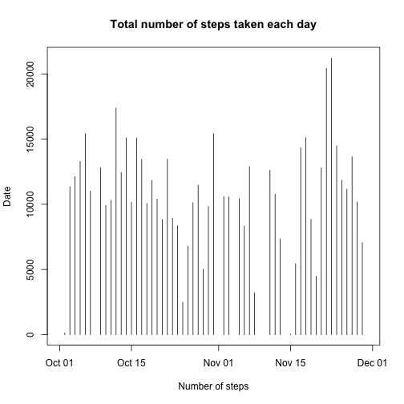
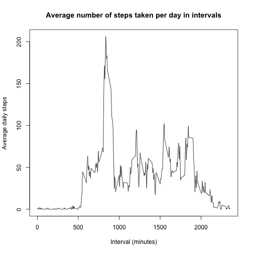
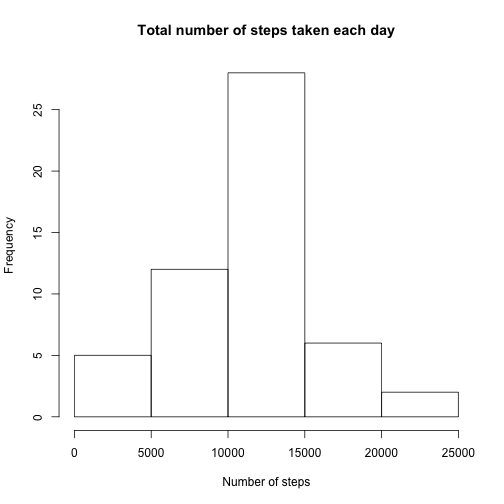
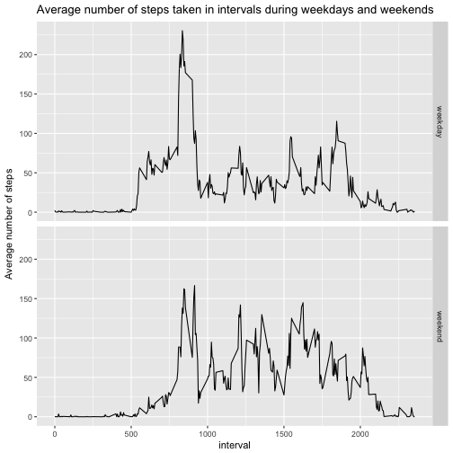

## Loading and preprocessing the data  

```r
library(ggplot2)
activity <- read.csv("/Users/Imo/Desktop/activity.csv", header = TRUE)
activity$date<- as.Date(activity$date) #change to the date class
```

Take a look at of the data and get a summary of it.  

```r
str(activity)
```

```
## 'data.frame':	17568 obs. of  3 variables:
##  $ steps   : int  NA NA NA NA NA NA NA NA NA NA ...
##  $ date    : Date, format: "2012-10-01" "2012-10-01" ...
##  $ interval: int  0 5 10 15 20 25 30 35 40 45 ...
```

```r
summary(activity)
```

```
##      steps             date               interval     
##  Min.   :  0.00   Min.   :2012-10-01   Min.   :   0.0  
##  1st Qu.:  0.00   1st Qu.:2012-10-16   1st Qu.: 588.8  
##  Median :  0.00   Median :2012-10-31   Median :1177.5  
##  Mean   : 37.38   Mean   :2012-10-31   Mean   :1177.5  
##  3rd Qu.: 12.00   3rd Qu.:2012-11-15   3rd Qu.:1766.2  
##  Max.   :806.00   Max.   :2012-11-30   Max.   :2355.0  
##  NA's   :2304
```

We can see that the data is the number of steps taken from 1/10/2012 to 30/11/2012. There are also a lot of zero's in the `steps` column.  


Change the data frame to the dyplr form for easier manipulation. And plot the histogram of total number of steps taken each day.

```r
library(dplyr)
act <- tbl_df(activity)
group_by(act, date) %>%
        summarise(Daysum=sum(steps)) %>%
                          plot(type="h",main="Total number of steps taken each day", xlab="Number of steps",ylab="Date") 
```



## What is mean total number of steps taken per day?  
Calculate the mean and median total number of steps taken per day.  

```r
group_by(act,date) %>%
        summarise(mean=
                mean(steps),median=median(steps))
```

```
## # A tibble: 61 x 3
##          date     mean median
##        <date>    <dbl>  <dbl>
##  1 2012-10-01       NA     NA
##  2 2012-10-02  0.43750      0
##  3 2012-10-03 39.41667      0
##  4 2012-10-04 42.06944      0
##  5 2012-10-05 46.15972      0
##  6 2012-10-06 53.54167      0
##  7 2012-10-07 38.24653      0
##  8 2012-10-08       NA     NA
##  9 2012-10-09 44.48264      0
## 10 2012-10-10 34.37500      0
## # ... with 51 more rows
```

## What is the average daily activity pattern?   

Plot a time series of the average number of steps taken

```r
a<- group_by(act,interval)
b<- summarise(a,mean=mean(steps,na.rm = TRUE))
plot(b,ylab="Average daily steps", xlab="Interval (minutes)",main = "Average number of steps taken per day in intervals", type = "l")
```



Calculate the 5-minute interval that, on average, contains the maximum number of steps.  

```r
#Interval with maximum average daily steps
filter(b, mean==max(mean))
```

```
## # A tibble: 1 x 2
##   interval     mean
##      <int>    <dbl>
## 1      835 206.1698
```

```r
#Interval with meddian average daily steps
filter(b,mean==median(mean))
```

```
## # A tibble: 0 x 2
## # ... with 2 variables: interval <int>, mean <dbl>
```

## Imputing missing values  

To impute missing data, this report uses a for-loop function to replace the NAs with the average steps of each interval calculated previously.   

```r
act_rmna<- act
for (i in 1:17568){
        if(is.na(act_rmna$steps[i]))
        {
                act_rmna$steps[i] = filter(b, b$interval==act_rmna$interval[i])[1,2]
        }
}
act_rmna$steps<-unlist(act_rmna$steps)
act_rmna
```

```
## # A tibble: 17,568 x 3
##        steps       date interval
##        <dbl>     <date>    <int>
##  1 1.7169811 2012-10-01        0
##  2 0.3396226 2012-10-01        5
##  3 0.1320755 2012-10-01       10
##  4 0.1509434 2012-10-01       15
##  5 0.0754717 2012-10-01       20
##  6 2.0943396 2012-10-01       25
##  7 0.5283019 2012-10-01       30
##  8 0.8679245 2012-10-01       35
##  9 0.0000000 2012-10-01       40
## 10 1.4716981 2012-10-01       45
## # ... with 17,558 more rows
```
We can see that all the NA's are now filled.  

Next, plot the gistogram of the total number of steps taken each day after NAs imputed.  


```r
a1<- group_by(act_rmna,date)
b1<- summarise(a1,mean=mean(steps,na.rm = T))
plot(b1, main = "Average number of steps taken per day with NAs imputed",ylab="Average daily steps", xlab="Date", type = "h")
```



Meand and median number of steps taken each day
sum over day

```r
#Interval with maximum average daily steps
filter(b1, mean==max(mean))
```

```
## # A tibble: 1 x 2
##         date     mean
##       <date>    <dbl>
## 1 2012-11-23 73.59028
```

```r
#Interval with meddian average daily steps
filter(b1,mean==median(mean))
```

```
## # A tibble: 8 x 2
##         date    mean
##       <date>   <dbl>
## 1 2012-10-01 37.3826
## 2 2012-10-08 37.3826
## 3 2012-11-01 37.3826
## 4 2012-11-04 37.3826
## 5 2012-11-09 37.3826
## 6 2012-11-10 37.3826
## 7 2012-11-14 37.3826
## 8 2012-11-30 37.3826
```

## Are there differences in activity patterns between weekdays and weekends?  

Panel plot comparing the avg. number of steps taken per 5-minute interval across weekdays and weekends.  

```r
#Create a new variable [week] with weekdays and weekends:
act_rmna[,4]<- weekdays(act_rmna$date)
week <- data.frame(0)
for (i in 1:17568){
        if(act_rmna$V4[i] %in% c("Saturday","Sunday"))
        {
                week[i,1]<- c("weekend")
        }
        else {week[i,1] <-c("weekday")}
}
week$X0<-factor(week$X0)

#Combine the new variable to original data frame
act_rmna$week<- week[,1]

#Calculate average steps
act1<- group_by(act_rmna, .dots=c("interval", "week"))
b2<- summarise(act1,mean=mean(steps))

#Make plots for weekdays and weekends
p = ggplot(b2, aes(x=interval,y=mean)) +geom_line()
p + facet_grid(week ~ .)+ylab("Average number of steps")+ggtitle("Average number of steps taken in intervals during weekdays and weekends")
```


  
  From the plots, we can see that on weekdays, the number of steps peaks around the interval 800 and dropped immediately to a low level. It fluctuated for the rest of the day.  
  However, during weekends, the number of steps also peaked at the same time, but it flunctuated at the same level for the rest of the day, with a graduate decrease from the interval 1600.


